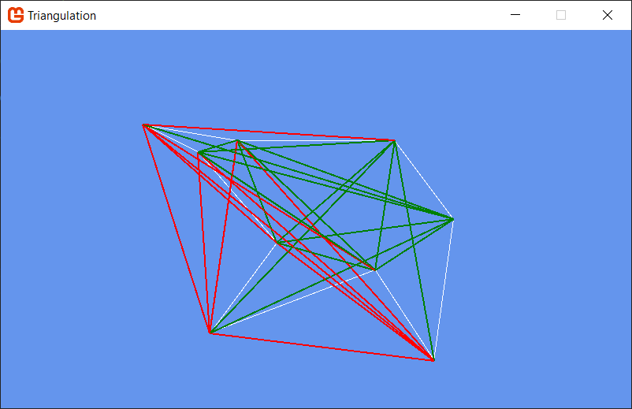
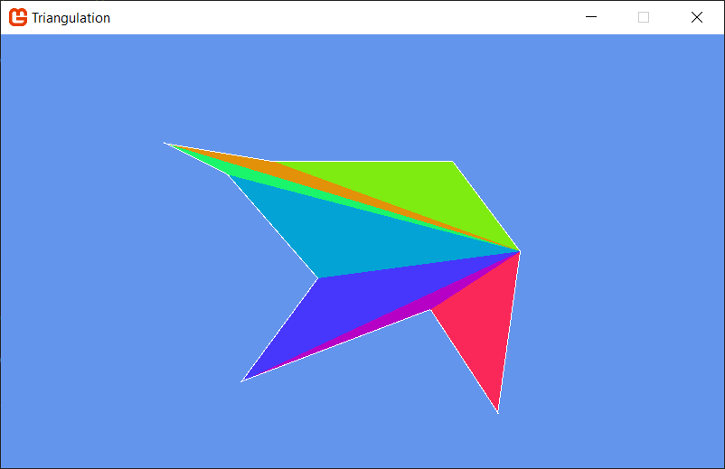

# ComGeom

A project exploring Computational Geometry ideas in C# using the MonoGame library for graphics.

Following along the textbook Joseph O'Rourke's "Computational Geometry in C".

```sh
dotnet run --project Triangulation
dotnet test
```
# Triangulation

Chapter 1 covers triangulation.

We develop algorithms for identifying valid diagonals in a polygon and
for reducing a polygon to a collection of triangles using the ear tip
removal algorithm.

Valid diagonals are shown here in green:


A triangulation for this shape is coloured in:

